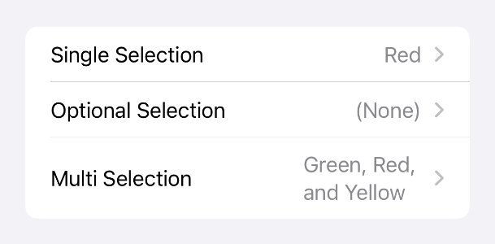
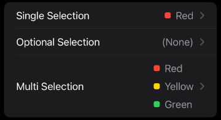
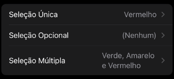
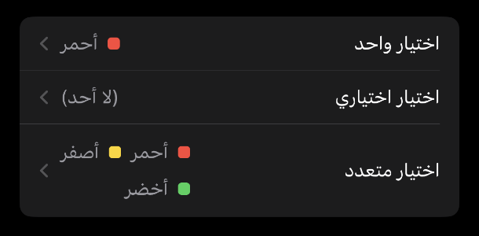
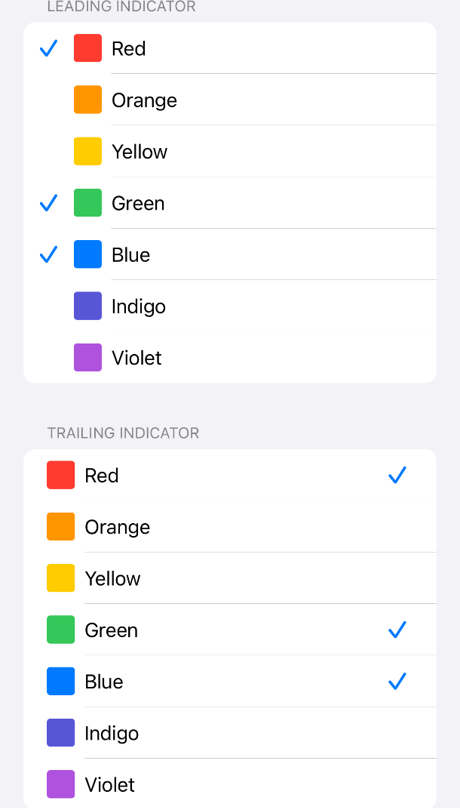
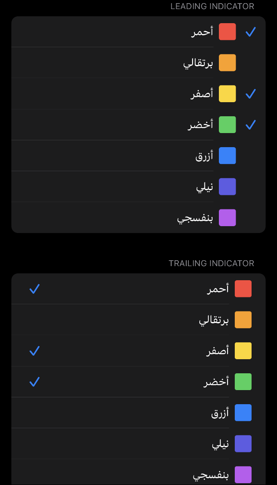

# MultiPicker

[](https://swiftpackageindex.com/toastersocks/MultiPicker)
[](https://swiftpackageindex.com/toastersocks/MultiPicker)


---

## A picker for selecting from multiple options. Or no options

SwiftUI's `Picker` on iOS only allows choosing exactly one option. If you need a picker that allows selecting one optional value, or multiple values from a set, you're outta luck. MultiPicker can do all three!








MultiPicker tries to make its API as close to the SwiftUI `Picker`'s as possible.

MultiPicker supports localization and accessibility and has better default accessibility than `Picker`.
MultiPicker supports string initializers as well as custom label views.
MultiPicker has a few additions and deviations from `Picker`:

- Supports putting the selection indicator (checkmark) on either the leading or trailing side of options via the `selectionIndicatorPosition(_:)` modifier.
- Currently only supports inline and navigationLink style pickers.
- The picker style is set using the `mpPickerStyle(_:)` instead of `pickerStyle(_:)` modifier.
- Views are tagged using the `mpTag(_:)` modifier instead of `tag(_:)`
- The pushed picker list is inset grouped instead of grouped because I think that looks nicer.

## Usage

Usage of `MultiPicker` is very similar to `Picker`:

```swift
struct MyView: View {
    @State private var selection: Set<Model> = []
    @State private var options: [Model]

    var body: some View {
        Form {
            MultiPicker("Choose something", selection: $selection) {
                ForEach(options) { option in
                    ModelCell(model: option)
                        .mpTag(option)
                }
            }
            .mpPickerStyle(.navigationLink)
        }
    }
}
```

Check the [documentation](https://swiftpackageindex.com/toastersocks/MultiPicker/documentation/multipicker) for more in-depth usage.

## Installing

### Swift Package Manager

#### Via Xcode

- Select your `.xcproject` file
- Select the project under `PROJECT`
- Select `Swift Package`
- Tap the `+` sign
- Paste this repo's address `https://github.com/toastersocks/MultiPicker` into the text field and hit 'Next'
- Choose your version/branch on the next screen
- Choose your targets and hit 'Finish'
